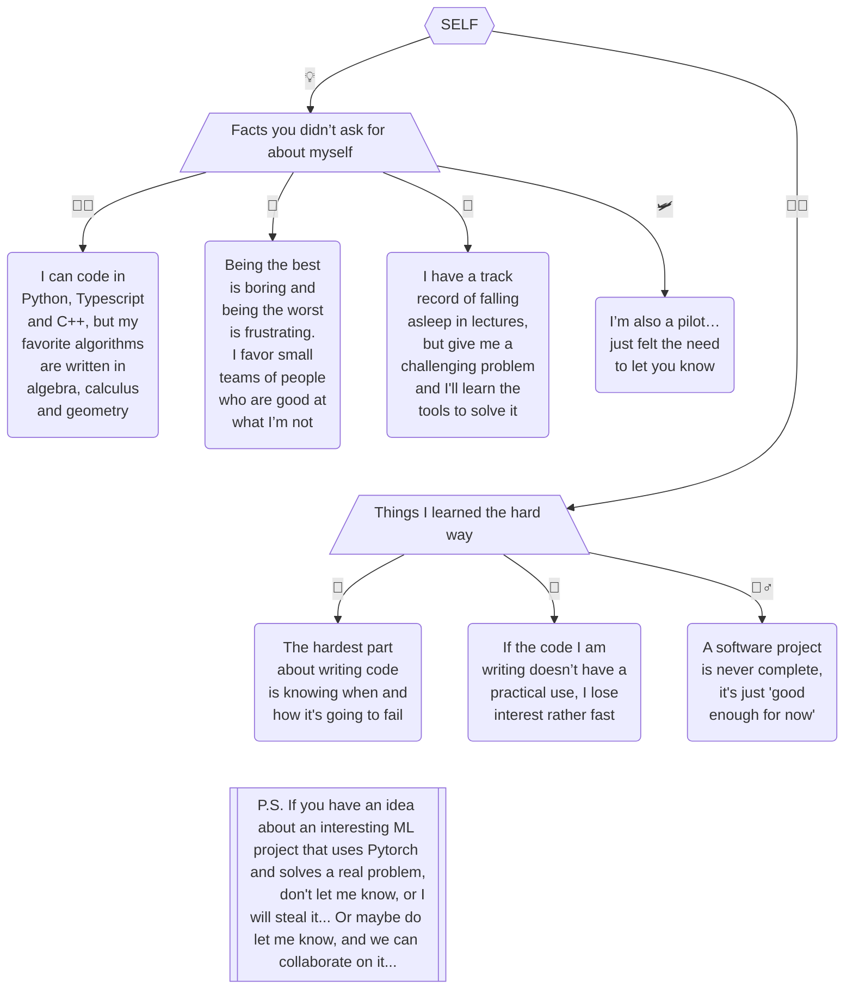

### Here's where I’d describe myself using words like passion and innovation… but I’m an engineer 🤦‍♂️

```mermaid
graph TD
    A{{SELF}} -->|💡| B[/Facts you didn’t ask for about myself\]
    A -->|😵‍💫| C[/Things I learned the hard way\]
    B -->|👨‍🔬| D(
        I can code in
        Python, Typescript
        and C++, but my
        favorite algorithms
        are written in
        algebra, calculus
        and geometry
    )
    B -->|🤝| E(
        Being the best
        is boring and
        being the worst
        is frustrating.
        I favor small
        teams of people
        who are good at
        what I’m not
    )
    B -->|🌱| F(
        I have a track
        record of falling
        asleep in lectures,
        but give me a
        challenging problem
        and I'll learn the
        tools to solve it
    )
    B -->|🛩| G(
        I’m also a pilot…
        just felt the need
        to let you know
    )
    C -->|🤯| H(
        The hardest part
        about writing code
        is knowing when and
        how it's going to fail
    )
    C -->|🥱| I(
        If the code I am
        writing doesn’t have a
        practical use, I lose
        interest rather fast
    )
    C -->|🤷‍♂️| J(
        A software project
        is never complete,
        it's just 'good
        enough for now'
    )
    E ~~~ C
    H ~~~ K[[
        P.S. If you have an idea about an interesting ML project that uses Pytorch and solves a real problem,
        don't let me know, or I will steal it... Or maybe do let me know, and we can collaborate on it...
    ]]
```

---

### Random icons that somehow describe my real skills:

 

